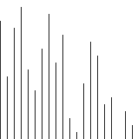

Shell排序
====

## 说明

希尔排序通过将比较的全部元素分为几个区域来提升插入排序的性能。这样可以让一个元素可以一次性地朝最终位置前进一大步。然后算法再取越来越小的步长进行排序，算法的最后一步就是普通的插入排序，但是到了这步，需排序的数据几乎是已排好的了（此时插入排序较快）。

## 步骤

1. 设置间隔（传统间隔为N/2）
2. 插入排序

## 图片示例


## 程序示例

### 传统实现

```go
//SortInt 传统shell排序,间隔为N/2
//相邻间隔可能不互质，可能会出现前置排序无用的情况
func SortInt(a []int) ([]int, int) {
	n := 0
	aLen := len(a)

	//定义间隔
	for i := aLen / 2; i > 0; i = i / 2 {

		//插入排序
		for j := i; j < aLen; j++ {
			tmp := a[j]
			k := j
			for ; k >= i && tmp < a[k-i]; k = k - i {
				a[k] = a[k-i]
				n++
			}
			a[k] = tmp
		}
	}
	return a, n
}

```

### Hibbard算法

```go

//SortHibbardInt Hibbard算法，间隔为2^k-1
func SortHibbardInt(a []int) ([]int, int) {
	n, i := 0, 0
	aLen := len(a)
	for i = 1; i <= aLen-1; i = i*2 + 1 {
	}
	//定义间隔
	for ; i > 0; i = (i - 1) / 2 {
		// println(i)
		//插入排序
		for j := i; j < aLen; j++ {
			tmp := a[j]
			k := j
			for ; k >= i && tmp < a[k-i]; k = k - i {
				a[k] = a[k-i]
				n++
			}
			a[k] = tmp
		}
	}
	return a, n
}
```